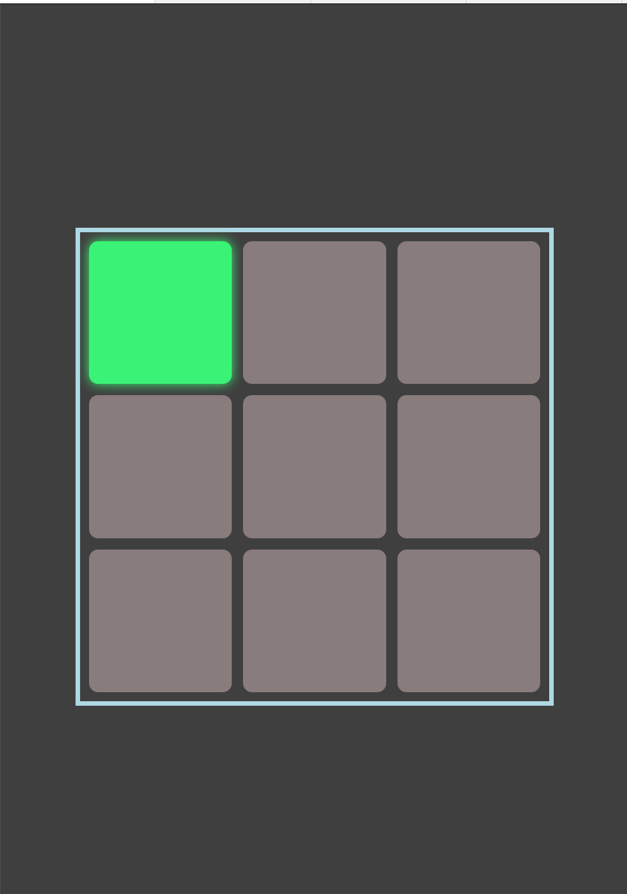

# Light Grid

A light grid that lets you turn on lights until the whole grid is lit up, then
the lights turn off in the order they were turned on.

## Getting Started

This app uses [vite](http://vite.dev/guide/), [yarn](https://yarnpkg.com), and
deploys as a static site.

- `yarn install`
- `yarn dev` to start the project with hot reloading

## Deployment

This app is most easily deployed to [heroku](http://heroku.com)-like
environment, like [dokku](http://dokku.com)

## Changes / Pull Request

This app was built as a warmup / practice exercise. It is not open for
pull-request or changes. I hope the code is useful as a reference or
inspiration.
